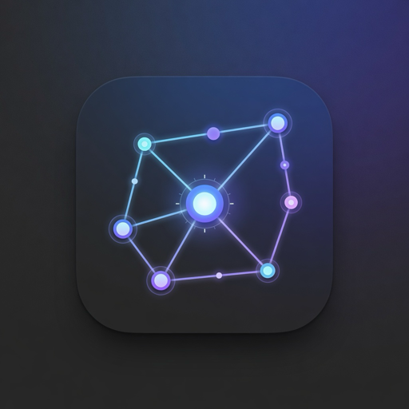
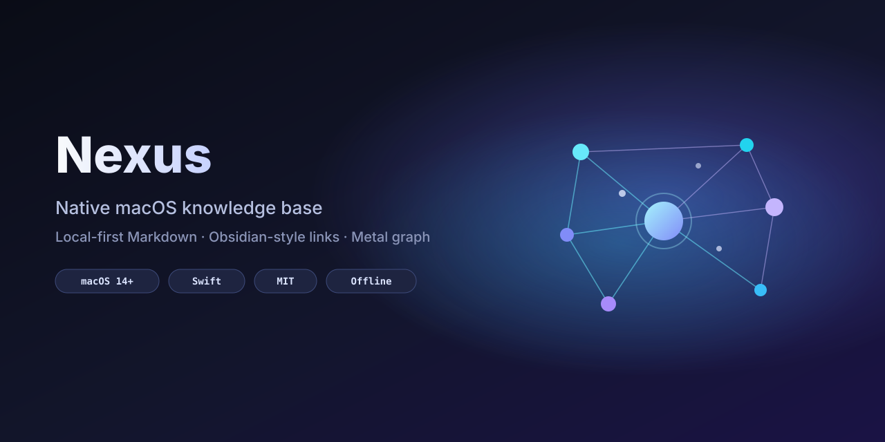
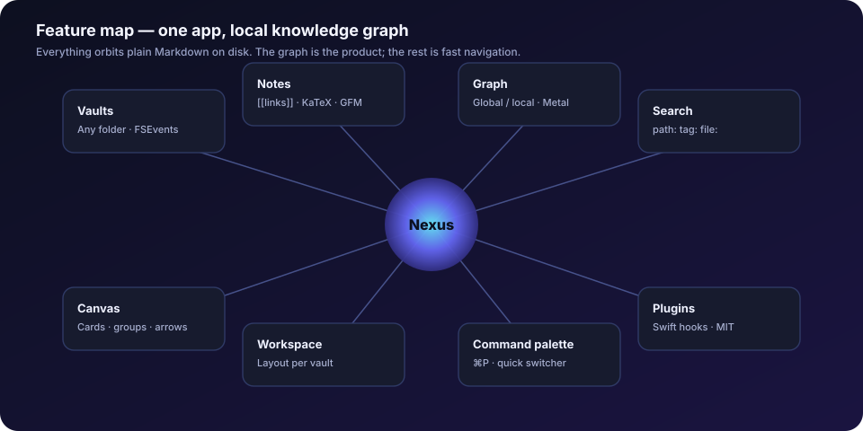
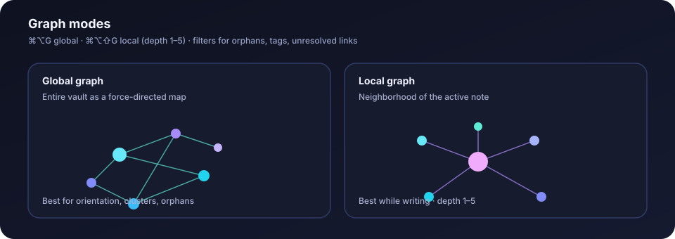
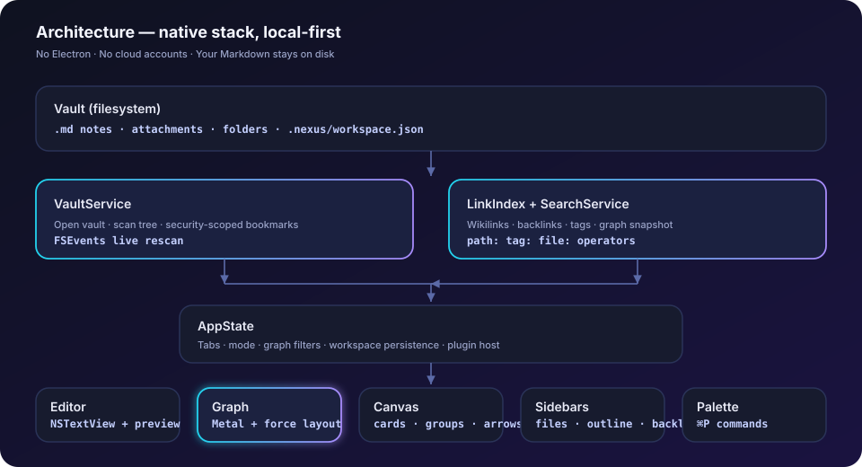
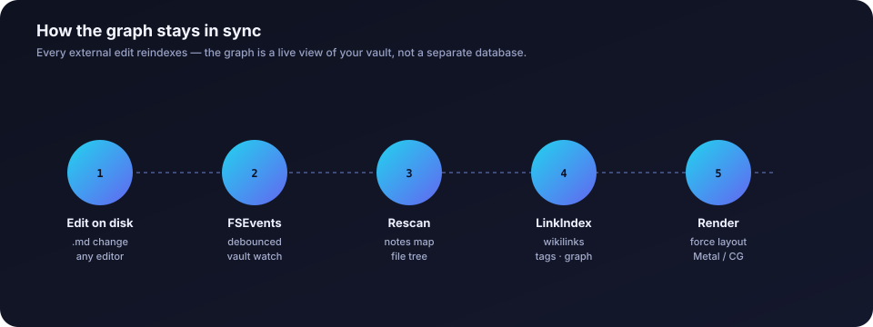
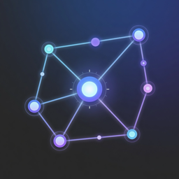

<p align="center">
  
</p>

<h1 align="center">Nexus</h1>

<p align="center">
  <strong>Native macOS knowledge base</strong> — local-first Markdown vaults,<br/>
  Obsidian-style linking, and a world-class graph visualizer.
</p>

<p align="center">
  
  
  
  
  
  
</p>

<p align="center">
  <a href="#install">Install</a> ·
  <a href="#why-native">Why native</a> ·
  <a href="#features">Features</a> ·
  <a href="#architecture">Architecture</a> ·
  <a href="#graph-engine">Graph</a> ·
  <a href="#keyboard-shortcuts">Shortcuts</a> ·
  <a href="#contributing">Contributing</a>
</p>

---

<p align="center">
  
</p>

---

## What is Nexus?

Nexus is a **real Mac app** for thinking in notes and links — not a website wrapped in a desktop shell.

| You keep | You get |
|----------|---------|
| Plain `.md` files on disk | Wikilinks, tags, backlinks, embeds |
| Your folder structure | Instant search with operators |
| Full offline ownership | Global + local force-directed graph |
| No accounts / no sync tax | Metal GPU graph path + AppKit chrome |

It is intentionally **local-first**: open any folder as a vault, edit with Nexus or any other editor, and the index (and graph) stay in sync via FSEvents.

> **Not affiliated with Obsidian.md.** Nexus speaks a familiar dialect (`[[wikilinks]]`, tags, callouts) so migration is natural — without plugin lock-in or Electron overhead.

---

## Install

### Requirements

- **macOS 14 Sonoma** or later  
- **Xcode 16+** (Swift 5.10+) for building from source  
- [XcodeGen](https://github.com/yonaskolb/XcodeGen) — `brew install xcodegen`

### Build & run (from source)

```bash
git clone https://github.com/austindixson/nexus.git
cd nexus
xcodegen generate
open Nexus.xcodeproj
```

In Xcode: scheme **Nexus** → **My Mac** → Run (`⌘R`).

**CLI build (Release):**

```bash
xcodegen generate
xcodebuild -scheme Nexus -configuration Release -destination 'platform=macOS' build
```

**Install the Release app to `/Applications`:**

```bash
# After a local DerivedData/Release build (or use the repo build/ path if you set -derivedDataPath)
cp -R /path/to/Nexus.app /Applications/
open -a Nexus
```

### First launch

1. **Open Vault…** or **Create Sample Vault**
2. Browse notes, try split preview
3. Press **`⌘⌥G`** for the global graph
4. Press **`⌘P`** for the command palette

---

## Why native?

<p align="center">
  
</p>

Web-shell apps (Electron / Tauri) give you a native *window*. Nexus is a native *product*:

| Surface | Implementation |
|---------|----------------|
| Chrome | Unified toolbar, sidebars, menus, key equivalents |
| Editor | `NSTextView` + system fonts |
| File watching | `FSEvents` (external edits reindex) |
| Graph | Force layout + **Metal** nodes/edges (Core Graphics fallback) |
| Permissions | Security-scoped vault bookmarks |
| Workspace | Per-vault `.nexus/workspace.json` |

**Design constraints we treat as features:**

- Fully offline  
- No telemetry  
- No accounts  
- MIT licensed  

---

## Features

### Vaults (local-first)

- Open **any folder** as a vault  
- Pure `.md` + attachments (images, PDFs, …)  
- Folder structure preserved  
- Live **FSEvents** watching — external editor changes reindex automatically  

### Notes

- Source / live preview / **split** editor  
- `[[Wikilinks]]`, `[[target|alias]]`, `![[embeds]]`  
- Tags (`#tag`), YAML frontmatter, headings outline  
- Task lists, code spans, **GFM tables**, **Obsidian callouts**, blockquotes  
- Offline **KaTeX** math (`$…$`, `$$…$$`, `\(...\)`, `\[...\]`)  
- Daily notes (`⌘D`), templates via command palette  
- Autosave  

### Graph view (centerpiece)

<p align="center">
  
</p>

- **Global** and **Local** graph (depth 1–5)  
- Force-directed physics (repulsion, springs, center force, damping)  
- Node size by degree  
- Zoom, pan, drag nodes  
- Hover → highlight neighbors, fade others  
- Click → open note; right-click context menu  
- Filters: query, orphans, tags, unresolved, attachments  
- Color by folder / tag / degree  
- Labels: always / hover / never  
- Tunable physics + presets + PNG export  
- **Metal** GPU path for nodes/edges (CG fallback + labels)  

### Navigation & shell

- Instant search with `path:`, `tag:`, `file:` operators  
- Backlinks + unlinked mentions  
- Freeform **canvas** (cards, groups, arrows)  
- Command palette (`⌘P`) + quick switcher (`⌘O`)  
- Light / dark / system appearance  
- Plugin API hooks (Swift) for commands & post-processors  
- **Workspace persistence** (`.nexus/workspace.json` per vault)  

### Ask Nexus (optional AI)

- Opt-in providers: **OpenAI**, **xAI / Grok**, **Anthropic (Claude)**, **DeepSeek**, **Ollama**, **Remote OpenAI-compatible**  
- API keys in Keychain only — no Nexus cloud accounts  
- **Local credentials**: reuse Claude Code / Codex CLI OAuth when no Keychain key is set; optional project `.env` (default `~/Desktop/CLM/.env`) for `DEEPSEEK_API_KEY` and similar — secrets are read at request time, not copied into Nexus  
- **Remote / Tailscale**: point Ollama or a Remote OpenAI-compatible base URL at `http://100.x.x.x:…`, MagicDNS, or Funnel HTTPS — use **Test connection** in Settings → AI  
- Cursor IDE login is not supported (no public inference API)  
- Offline Ask still returns ranked vault hits when AI is disabled  

---

## Architecture

<p align="center">
  
</p>

```
Nexus/
├── NexusApp.swift                 # App entry, menus, window chrome
├── Models/                        # Notes, graph, canvas types
├── Services/
│   ├── VaultService.swift         # Folder vault + FSEvents watcher
│   ├── LinkIndex.swift            # Wikilinks, backlinks, graph snapshot
│   ├── SearchService.swift        # Full-text + operators
│   ├── AppState.swift             # UI state, tabs, graph settings
│   ├── WorkspaceService.swift     # Layout persistence
│   └── PluginAPI.swift            # Swift plugin host
├── GraphEngine/
│   ├── ForceSimulator.swift       # Force-directed layout
│   └── MetalGraphRenderer.swift   # GPU nodes/edges
├── Views/
│   ├── RootView.swift             # NavigationSplitView shell
│   ├── Editor/                    # NSTextView + WKWebView preview
│   ├── Graph/                     # Interactive graph canvas
│   ├── Canvas/                    # Freeform canvas
│   ├── Sidebar/                   # Files, search, tags, outline, backlinks
│   ├── CommandPalette/
│   └── Settings/
├── Utilities/MarkdownParser.swift
└── Resources/
    ├── Assets.xcassets/           # App icon + accent
    └── katex/                     # Offline math bundle
```

### How the graph stays in sync

<p align="center">
  
</p>

1. **`VaultService`** scans the vault into `[path: NoteDocument]` and builds the file tree.  
2. An **`FSEventStream`** watches the vault root; debounced rescans pick up external edits.  
3. **`AppState`** observes `vault.$notes` and calls `LinkIndex.rebuild(from:)`.  
4. **`LinkIndex`** extracts `[[wikilinks]]` / tags, resolves targets, and publishes a `GraphSnapshot` (nodes + edges) plus backlinks.  
5. **`GraphView`** filters that snapshot (global/local, orphans, tags…) and feeds **`ForceSimulator`**.  
6. A ~60 fps loop integrates physics; **Metal** draws nodes/edges (Core Graphics fallback + labels).

The graph engine is isolated under `GraphEngine/` so rendering can evolve without touching vault I/O.

---

## Graph engine

### Scale expectations

| Vault size | Expected graph behavior |
|------------|-------------------------|
| &lt; 500 nodes | Full O(n²) repulsion, silky 60 fps |
| 500–2k | Interactive; layout settles in ~1–3 s |
| 2k–8k | Spatial-hash repulsion; pan/zoom stay smooth; prefer filters |
| 8k–15k | Prefer **Local** graph; hide orphans/tags; lower animation strength |

**Tips for large vaults**

- Prefer **Local graph** while writing  
- Disable tag nodes and unresolved links in Global view  
- Lower **Repulsion** / **Animation** if CPU spikes  
- Metal path on; fall back to CG only if needed  

### Manual benchmark recipe

1. Generate N notes with random `[[links]]` (see `scripts/generate-memory-stress-vault.sh`)  
2. Open Global Graph, wait for α to cool  
3. Observe FPS while panning (Instruments → Core Animation)  

---

## Plugin API

```swift
final class MyPlugin: NexusPlugin {
    let id = "com.example.myplugin"
    let name = "My Plugin"
    let version = "1.0.0"

    @MainActor
    func activate(api: PluginContext) async {
        api.registerCommand(id: "hello", title: "Hello from plugin") {
            // api.openNote, api.getVaultNotes(), …
        }
        api.registerMarkdownPostProcessor { markdown in
            return markdown
        }
    }

    func deactivate() async {}
}

// At launch:
await pluginHost.register(MyPlugin())
```

See `Services/PluginAPI.swift` and the sample word-count plugin.

---

## Keyboard shortcuts

| Shortcut | Action |
|----------|--------|
| `⌘N` | New note |
| `⌘⇧O` | Open vault |
| `⌘O` | Quick switcher |
| `⌘P` | Command palette |
| `⌘D` | Daily note |
| `⌘⇧F` | Search vault |
| `⌘⌥G` | Graph view |
| `⌘⌥⇧G` | Local graph |
| `⌘⌥E` | Editor |
| `⌘⌥C` | Canvas |
| `⌘⌥1` / `⌘⌥2` | Toggle sidebars |

---

## Development

```bash
# Regenerate project after project.yml changes
xcodegen generate

# Debug build
xcodebuild -scheme Nexus -configuration Debug -destination 'platform=macOS' build

# Tests
xcodebuild -scheme Nexus -destination 'platform=macOS' test
```

| Area | Status |
|------|--------|
| Native shell, vaults, FSEvents | Done |
| Editor + KaTeX + GFM tables/callouts | Done |
| Metal graph + CG fallback | Done |
| Workspace persistence | Done |
| Unit + e2e tests | Green |
| Hotkey customizer UI | Planned |
| Metal instancing / 15k stress | Planned |
| `.nexusplugin` bundle loading | Planned |

---

## Branding assets

| Asset | Path |
|-------|------|
| App icon (rounded presentation) | [`docs/assets/logo.png`](docs/assets/logo.png) |
| Full-bleed icon master | [`docs/assets/icon.png`](docs/assets/icon.png) / [`branding/icon-master-1024.png`](branding/icon-master-1024.png) |
| Hero / social visuals | [`docs/assets/hero.svg`](docs/assets/hero.svg), [`docs/assets/banner.png`](docs/assets/banner.png) |
| Architecture / flow diagrams | [`docs/assets/*.svg`](docs/assets/) |

macOS **AppIcon** images live in  
`Nexus/Resources/Assets.xcassets/AppIcon.appiconset/`.

---

## Roadmap

- [x] Metal graph renderer (initial; instancing / large-vault stress next)  
- [x] KaTeX + GFM tables + callouts in preview  
- [x] Workspace layout persistence  
- [x] Brand identity + GitHub landing visuals  
- [x] Cloud / remote LLM presets (OpenAI, Anthropic, Tailscale-friendly URLs)  
- [ ] Hotkey customizer UI  
- [ ] Metal edge thickness + large-vault stress / instancing  
- [ ] `.nexusplugin` bundle loading from vault  
- [ ] iCloud Drive vault-friendly conflict handling  

---

## Contributing

1. Fork + branch from `main`  
2. Keep the **native Swift** path — do not reintroduce Electron/Tauri scaffolds  
3. Prefer small, reviewable PRs (parser, graph, shell)  
4. Run unit tests before opening a PR  
5. Match existing code style (SwiftUI + AppKit hybrid, main-actor UI state)  

Bug reports and design critiques welcome via Issues.

---

## License

MIT — see [LICENSE](./LICENSE).

Nexus is not affiliated with Obsidian.md.

<p align="center">
  
  <br/>
  <sub>Your notes. Your disk. Your graph.</sub>
</p>
